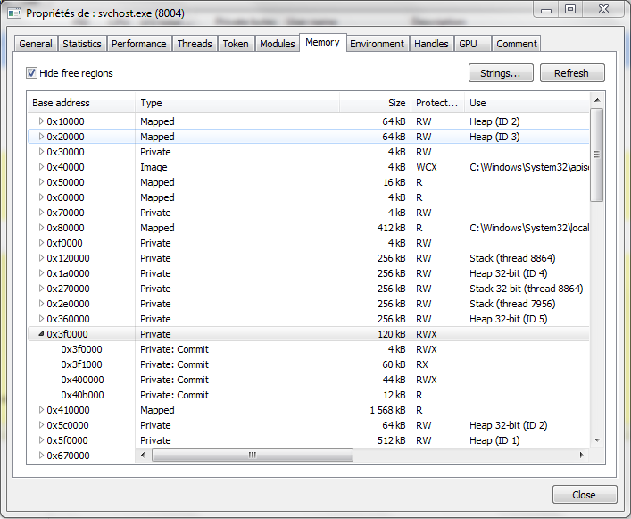

# RunPE
Technique de Process Hollwing, injecte un exécutable 32 bits dans un autre.

## Lance nslookup dans svchost
RunPE.exe C:\Windows\SysWOW64\svchost.exe C:\Windows\SysWOW64\nslookup.exe

L'image de l'exécutable nslookup est placé à l'ancienne adresse de l'image de svchost (0x3f0000)
Lors d'une exécution normale l'image est mappée avec la protection WCX,
on remarque la region suspecte à cause de la protection RWX.

